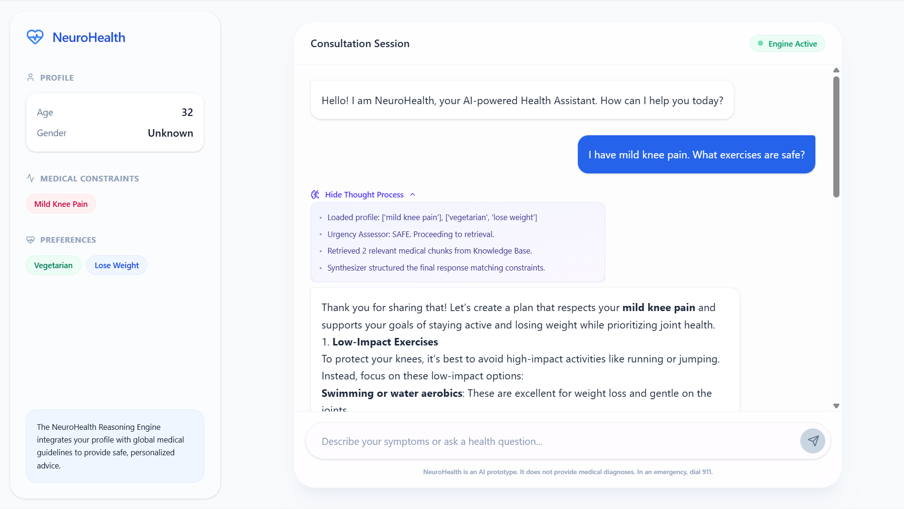

# NeuroHealth
**AI-Powered Health Assistant with LLM-Driven Reasoning and RAG Architecture**



[](https://summerofcode.withgoogle.com/)
[](https://ucsc-ospo.github.io/osre/)

> **Note:** This repository contains the **Working Prototype** supporting the GSoC 2026 proposal for **UCSC OSPO / OSRE 2026**.

## Overview

Global healthcare systems face an accessibility-quality paradox. While patients increasingly turn to unregulated digital sources, existing tools like unconstrained LLMs hallucinate medical advice, and rule-based symptom checkers lack contextual reasoning. 

**NeuroHealth** bridges this gap. It is a **LangGraph-orchestrated multi-node reasoning architecture** that combines the contextual reasoning and natural language fluency of Large Language Models with clinical grounding, safety guarantees, and personalization.

## Core Architecture

The system decomposes health inquiries into a Directed Acyclic Graph (DAG) of specialized processing stages to ensure safe and accurate responses. The prototype establishes three key guarantees:

1. **Safety-First Routing**: A dedicated zero-temperature Urgency Assessor node intercepts life-threatening presentations (e.g., chest pain, stroke symptoms) *before* knowledge retrieval, ensuring immediate emergency guidance.
2. **Grounded Generation**: Non-emergency responses strictly utilize **ChromaDB** to retrieve validated clinical guidelines (RAG), minimizing free-form hallucination.
3. **Personalized Reasoning**: User profiles mapping medical constraints, allergies, and dietary preferences are injected directly into the LLM context window to provide personalized, clinically bounded recommendations.

### LangGraph State Machine Nodes

- **Profile Loader**: Injects the user's medical profile and constraints into the state.
- **Urgency Assessor**: A binary classifier routing to `EMERGENCY` (bypassing RAG) or `SAFE`.
- **RAG Retriever**: Embeds inquiries using OpenAI's `text-embedding-3-small` and performs vector search against clinical data.
- **Response Synthesizer**: Constructs a custom recommendation leveraging system prompts, retrieved data, constraints, and conversational context via GPT-4o (GitHub Models API).

## Repository Structure

The project follows a layered, decoupled design:

- **[`frontend/`](./frontend)**: Presentation Layer. A modern conversational UI built with **Next.js (React 19)**, **Tailwind CSS 4**, and **Framer Motion** for real-time reasoning chain visualization.
- **[`backend/`](./backend)**: API & Engine Layer. Powered by **FastAPI** and **Python**, containing the LangGraph state machine, RAG pipeline, and urgency triage routing.
- **[`chroma_db/`](./chroma_db)**: Data Layer. Persistent SQLite database for **ChromaDB**, holding embedded medical knowledge and guidelines for precise RAG lookups.

## Quick Start

### Prerequisites
- Node.js (v18+)
- Python (v3.10+)
- `GITHUB_TOKEN` (for prototyping inference via GitHub Models)

### 1. Initialize Backend Engine
Navigate to the `backend` directory to configure the FastAPI server and LangGraph engine:

```bash
cd backend
python -m venv .venv
source .venv/bin/activate
pip install -r requirements.txt

# Configure your token for GitHub Models
export GITHUB_TOKEN="your_fine_grained_personal_access_token"

# Launch backend cluster on port 8000
fastapi dev main.py
```
*The API will be available at `http://localhost:8000`.*

### 2. Launch Client Interface
Navigate to the `frontend` directory to start the Next.js presentation instance:

```bash
cd frontend
npm install
npm run dev
```
*The application will be accessible at `http://localhost:3000`.*

## Future GSoC Deliverables

Pending the GSoC 2026 engagement, NeuroHealth will be expanded to encompass:
- **Extended Agentic Engine**: 10+ reasoning nodes including Intent Recognizer, Symptom Extractor, Medication Checker, and Clarification Agent.
- **Hypothetical Document Embeddings (HyDE)**: Pre-computation of ideal answers to maximize retrieval precision.
- **Evaluation Framework**: Standardized test suite against 200+ clinical vignettes mapped to clinician reviews.

## Author

**Anirudh Singh Sengar**
- [GitHub](https://github.com/anirudhsengar)
- [LinkedIn](https://linkedin.com/in/anirudhsengar)
- [Website](https://anirudhsengar.dev)
