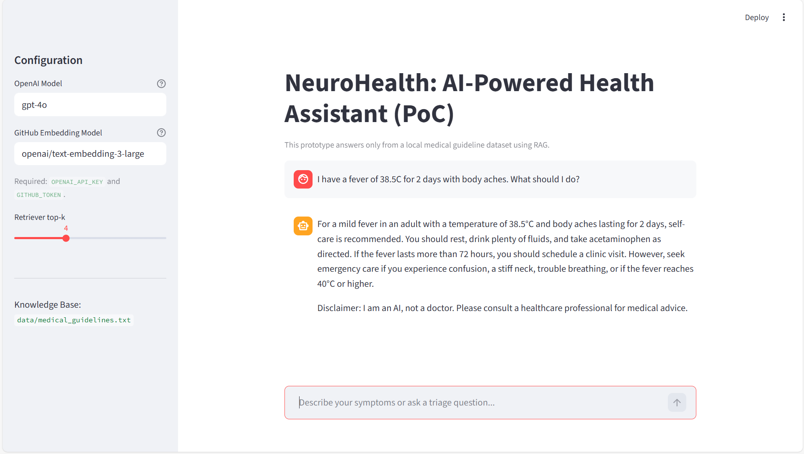
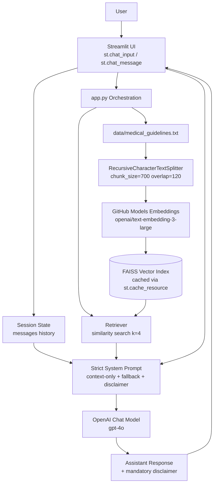

# NeuroHealth: AI-Powered Health Assistant (RAG PoC)

A production-style micro-prototype of a privacy-conscious medical triage chatbot using Retrieval-Augmented Generation (RAG).

- UI: Streamlit chat interface
- Orchestration: LangChain
- Vector DB: FAISS (local)
- Embeddings: GitHub Models (`openai/text-embedding-3-large`)
- LLM: OpenAI (`gpt-4o`)

## Features

- Conversational RAG over a local medical guideline file.
- Strict context-only response policy via system prompt.
- Deterministic fallback for missing knowledge:
  - `I do not have enough information in my current medical database to answer this`
- Mandatory medical disclaimer appended to every response.
- FAISS index and embedding client cached with `st.cache_resource`.
- Clear error handling for missing files, missing keys, and API failures.

## Project Structure

```text
NeuroHealth/
├── app.py
├── requirements.txt
├── .env.example
├── data/
│   └── medical_guidelines.txt
└── docs/
    └── architecture.mmd
```

## Prerequisites

- Python 3.11+
- API credentials:
  - `OPENAI_API_KEY`
  - `GITHUB_TOKEN` (for GitHub Models embeddings)

## Setup

### Option A: Existing `.venv` + `uv` (recommended)

```bash
uv pip install --python .venv/bin/python -r requirements.txt
cp .env.example .env
```

### Option B: Standard `venv` + `pip`

```bash
python -m venv .venv
source .venv/bin/activate
python -m pip install -r requirements.txt
cp .env.example .env
```

## Environment Variables

Set these in `.env`:

```bash
OPENAI_API_KEY=your_openai_api_key_here
GITHUB_TOKEN=your_github_token_here
```

Optional:

```bash
GITHUB_MODELS_ENDPOINT=https://models.github.ai/inference
OPENAI_BASE_URL=
```

## Run

```bash
./.venv/bin/streamlit run app.py
```

Then open the local URL shown in terminal (typically `http://localhost:8501`).

## Example User Queries

- `I have a fever of 38.5C for 2 days with body aches. What should I do?`
- `I twisted my ankle and it is swollen, but I can still walk. What is the triage advice?`
- `I have sneezing and itchy eyes for one week. Is this seasonal allergy and what home care is suggested?`

## UI Preview

Sample chat run in Streamlit for:
`I have a fever of 38.5C for 2 days with body aches. What should I do?`



## Architecture Diagram

Source file: [`docs/architecture.mmd`](docs/architecture.mmd)



## Request Flow (High Level)

1. User sends a symptom question in Streamlit chat.
2. App builds/reuses local FAISS index from `data/medical_guidelines.txt`.
3. Retriever pulls top-`k` relevant chunks.
4. Prompt injects retrieved context + chat history with strict constraints.
5. `gpt-4o` generates answer.
6. App enforces final disclaimer and returns response.

## Notes

- This is a preliminary assistant for educational/demo purposes.
- It is not a medical diagnostic system.
- Always consult a licensed clinician for real medical decisions.
